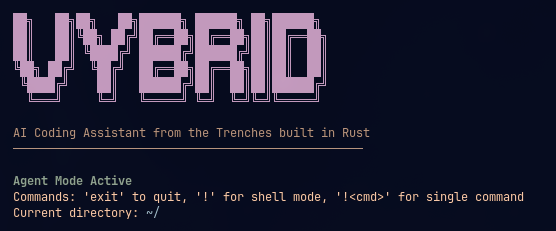

<p align="center">
  
</p>

# Vybrid

AI powered coding assistant built from the trenches with Rust to save humanity from bloat.

**Repository:** [github.com/SampleBias/vybrid](https://github.com/SampleBias/vybrid)

## Features

- **Agent Mode**: Full AI Engineer with file operations, shell commands, and web search
- **Rust-Aware Diagnostics**: Structured Cargo/rustc summaries for ownership, traits, enums, lifetimes, async, and clippy feedback
- **Persistent Shell**: Interactive shell mode with state persistence
- **Function Calling**: Tools for file operations, code search, Cargo, rustc explanations, and Rust project snapshots

## Requirements

- Linux (Ubuntu 20.04+ recommended)
- Rust 1.70+ (for building from source)
- One of:
  - **[Groq](https://console.groq.com/)** API key ([`openai/gpt-oss-120b`](https://console.groq.com/docs/model/openai/gpt-oss-120b)), or
  - **[LM Studio](https://lmstudio.ai/)** with the [local server](https://lmstudio.ai/docs/developer/core/server) running and a model loaded (OpenAI-compatible API — see below)

## Installation

### From Source

```bash
git clone https://github.com/SampleBias/vybrid.git
cd vybrid/vybrid-rust

# Build release version
cargo build --release

# Binary will be at target/release/vybrid
```

### Copy Binary (Optional)

```bash
# Copy to user bin
cp target/release/vybrid ~/.local/bin/

# Or system-wide
sudo cp target/release/vybrid /usr/local/bin/
```

## Configuration

Keys are loaded from **`~/.vybrid/.env`** first, then **`vybrid-rust/.env`** (project wins if both define the same variable). When you save via **`/menu`**, both files are updated so you only configure once and can run Vybrid from **any directory**. Use **`/menu`** or create the files manually:

```bash
# LLM backend: groq (default) or lmstudio
# VYBRID_LLM_PROVIDER=groq

# --- Groq (cloud) ---
GROQ_API_KEY=your_api_key_here
# Optional: override model (default is openai/gpt-oss-120b)
# GROQ_MODEL=openai/gpt-oss-120b

# --- LM Studio (local) — set VYBRID_LLM_PROVIDER=lmstudio and fill these ---
# LM_STUDIO_BASE_URL=http://127.0.0.1:1234/v1
# LM_STUDIO_API_KEY=lm-studio
# LM_STUDIO_MODEL=your-loaded-model-id

# Optional: SerpAPI for Google Search
SERPAPI_KEY=your_serpapi_key_here
```

### Active provider (`VYBRID_LLM_PROVIDER`) and coexisting credentials

- **`VYBRID_LLM_PROVIDER`** is `groq` (default) or `lmstudio`. It selects **which backend handles chat**; only one runs at a time.
- You can keep **both** Groq settings (`GROQ_API_KEY`, optional `GROQ_MODEL`) **and** LM Studio settings (`LM_STUDIO_*`) in the same `~/.vybrid/.env` and `vybrid-rust/.env`. They do not overwrite each other. Switching the active provider (via **`/menu`** — e.g. “Configure LM Studio” or “Switch to Groq (cloud)”) or editing **`VYBRID_LLM_PROVIDER`** only changes **which** profile is used, not the stored keys for the other backend.

If you run a compiled binary from a different path, set **`VYBRID_ROOT`** to the `vybrid-rust` directory so Vybrid can find `.env`.

Create a Groq key in the [Groq Console](https://console.groq.com/keys). For LM Studio, use **`/menu`** → “Configure LM Studio” or set the variables above; see [LM Studio (local, offline)](#lm-studio-local-offline).

### LM Studio (local, offline)

Vybrid talks to LM Studio’s **OpenAI-compatible** HTTP API ([docs](https://lmstudio.ai/docs/developer/openai-compat)): same `POST /v1/chat/completions` flow as Groq, with base URL typically `http://127.0.0.1:1234/v1` (port is configurable in LM Studio under **Developer → Local Server**).

1. In LM Studio, load a model and start the local server ([server overview](https://lmstudio.ai/docs/developer/core/server)).
2. Set **`VYBRID_LLM_PROVIDER=lmstudio`**.
3. Set **`LM_STUDIO_MODEL`** to the **exact model identifier** of the loaded model (must match what LM Studio exposes for chat).
4. Set **`LM_STUDIO_BASE_URL`** if you are not using the default host/port (default in Vybrid is `http://127.0.0.1:1234/v1`).
5. **API key**: If the server has **Require authentication** off, you can use a placeholder (Vybrid defaults to `lm-studio`). If authentication is on (LM Studio 0.4.0+), create a token under **Developer → Server Settings → Manage Tokens** and set **`LM_STUDIO_API_KEY`**; requests use `Authorization: Bearer` as in the [authentication docs](https://lmstudio.ai/docs/developer/core/authentication).

Use **`/menu`** to save these to `~/.vybrid/.env` and `vybrid-rust/.env`. Use **`/menu`** → “Switch to Groq (cloud)” when you want to return to Groq.

Keep real keys out of version control: `.env` and `.env.*` are listed in the repo `.gitignore` (only `.env.example` is meant to be committed as a template).

## Usage

```bash
# Run Vybrid
./vybrid

# Or if installed to PATH
vybrid
```

### Startup

Vybrid starts directly in **Agent Mode** with all tools available.

### Agent Mode Commands

| Command | Description |
|---------|-------------|
| `exit`, `quit` | Exit Vybrid |
| `!` | Enter persistent shell mode |
| `!<cmd>` | Execute single shell command |
| `/add <path>` | Add file to conversation |
| `/pwd` | Show current directory |
| `/tools` | List available AI tools |
| `/new` | Start new conversation |
| `/help` | Show help |
| `/menu` | Menu (Groq, LM Studio, SerpAPI; saved to `~/.vybrid/.env` and `vybrid-rust/.env`) |
| `clear` | Clear screen |

### Available Tools

The AI can use these tools automatically:

- **File Operations**: `read_file`, `read_multiple_files`, `create_file`, `create_multiple_files`, `edit_file`
- **Shell**: `execute_bash_command`
- **Rust**: `run_cargo`, `cargo_metadata`, `rust_project_snapshot`, `explain_rust_diagnostic`
- **Search**: `enhanced_grep`, `google_search`
- **Project**: `create_project_structure`, `get_current_todo_items`, `mark_todo_complete`

## Project Structure

```
vybrid-rust/
├── Cargo.toml          # Dependencies and project config
├── src/
│   ├── main.rs         # Entry point
│   ├── config.rs       # Configuration management
│   ├── conversation.rs # Conversation history and context pruning
│   ├── project_docs.rs # Project-specific docs context
│   ├── rust_agent_reference.rs # Rust workflow and diagnostic guidance
│   ├── ui.rs           # Terminal UI helpers
│   ├── client/
│   │   └── groq.rs     # Groq OpenAI-compatible chat client
│   ├── tools/
│   │   ├── definitions.rs  # Tool schemas
│   │   ├── executor.rs     # Tool dispatcher
│   │   ├── cargo.rs        # Structured Cargo and diagnostics
│   │   ├── rust.rs         # rustc explanations and project snapshots
│   │   ├── file_ops.rs     # File operations
│   │   ├── shell.rs        # Shell execution
│   │   ├── grep.rs         # Code search
│   │   ├── search.rs       # Google search
│   │   └── project.rs      # Project structure
│   └── shell/
│       └── persistent.rs   # Persistent shell
```

## Rust Diagnostic Workflow

For Rust projects, Vybrid is expected to inspect crate shape with `rust_project_snapshot` or `cargo_metadata`, run `run_cargo` for `check`, `test`, `clippy`, and `fmt`, and use `diagnostic_format=json` when compiler output needs structured summaries. `explain_rust_diagnostic` can expand rustc codes such as `E0382`, `E0499`, and `E0502`.

## Verification

```bash
cd vybrid-rust
cargo fmt --check
cargo test
cargo clippy -- -D warnings
```

## Data Directory

- **API keys**: mirrored in **`~/.vybrid/.env`** and **`vybrid-rust/.env`** (same values; use from any cwd)

Vybrid also stores runtime data in `~/.vybrid/`:

- `messages/` - Inter-process communication for daemon mode
- `daemon_pool/` - Daemon lock files
- `progress/` - Request progress tracking

## Changelog

### 1.1.0

- README: documented **`VYBRID_LLM_PROVIDER`** and keeping Groq + LM Studio credentials in the same env files.
- CLI: while waiting for the model, the spinner label is **`local`** when LM Studio is the active provider (still **`groq`** for Groq).

## License

MIT License

## Credits

Default inference uses [Groq](https://groq.com/) with [`openai/gpt-oss-120b`](https://console.groq.com/docs/model/openai/gpt-oss-120b) ([OpenAI-compatible API](https://console.groq.com/docs/openai)). You can instead use a local model via [LM Studio](https://lmstudio.ai/) ([OpenAI compatibility](https://lmstudio.ai/docs/developer/openai-compat)).
